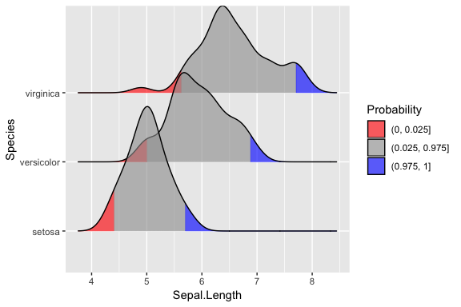
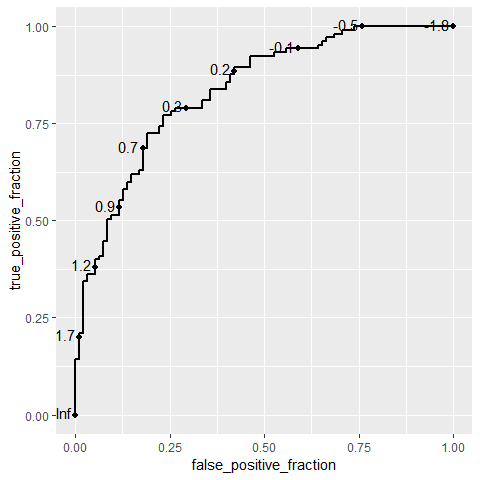
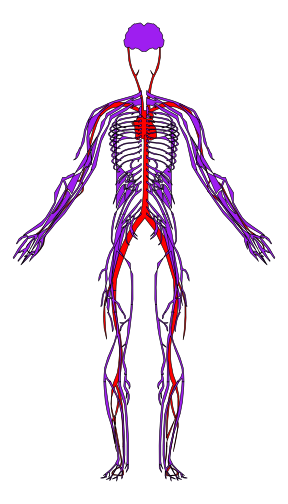

\pagebreak

#Using ggplot2: Lecture

The basic plotting functions of R are nice to quickly visualize data, however, the strength of R is that it has many packages with extra functionality created by others that you can use. ggplot2 is one of those packages, created by Hadley Wickham. ggplot2 allows you to build more sophisticated plots in R using a "Grammar of Grappics" (therefore GGplot). 

If ggplot2 is not yet available for you we need to install and load the ggplot2 library like so.

```{r, eval=FALSE}
install.packages("ggplot2")
library(ggplot2)
```
```{r, echo=FALSE}
library(ggplot2)
```

ggplot2 is a very extensive package, so it is impossible to show all the possibilities during this course. If you would like to experiment further, the ggplot manual at <http://ggplot2.tidyverse.org/reference/index.html> is the place to go. A large variety of functionallities are listed there, including example plots.

##Grammar of graphics

The grammar of graphics consists of a number of "layers", which generate a ggplot, when correctly put together. These five basic layers will be discussed here:

- Data
- Aesthetics
- Geometries
- Facets
- Scales
- Themes

##Data
The basis of each plot is the data. To plot data with ggplot the data needs to be of the class "data.frame". The structure of your data.frame is important when you want to plot it with ggplot. Each variable you want to use has to be in a separate column in your data.frame. Take for example the "Indometh" dataset which comes with R.

```{r, eval=FALSE}
?Indometh
```

The "Indometh"" dataset describes the pharmacokinetics of indomethacin after intravenous injection of indomethacin in six subjects. The data.frame has three columns one containing the subject number, one containing the time of sampling in hours, and one containing the indomethacin concentration ug/ml. This dataset is easily plotted with ggplot because it is a data.frame and every column contains a separate variable. 

```{r, echo=F}
head(Indometh)
```

An example of a badly formatted dataset for visualization with ggplot is a dataset of monthly deaths from lung diseases in the UK:

```{r, eval=FALSE}
?ldeaths
```

This dataset contains three separate datasets for female, male and both male and female deaths (ldeaths, fdeaths, and mdeaths). The columns contain values per month and the rows indicate the year.

```{r, echo=F}
ldeaths
```

This dataset cannot be easily plotted using ggplot for three reasons:

* The dataset is not of the class data.frame
* The male and female datasets are separated in two objects
* The columns do not represent distinct variable values

We can use some more advanced R data reshaping to get these datasets in the right shape.

```{r, echo=F}
deaths <- c(fdeaths,mdeaths)
sex <- rep(c("female","male"),each=72)
years <- rep(c("1974","1975","1976","1977","1978","1979"),each=12)
months <- rep(c("Jan","Feb","Mar","Apr","May","Jun","Jul","Aug","Sep","Oct","Nov","Dec"),6)
data <- data.frame("Deaths"=deaths,"Year"=years,"Month"=months,"Sex"=sex)
head(data)
```

\pagebreak

```{r, fig.align="center"}
ggplot(data, aes(x=Month, y=Deaths, color=Sex)) + geom_point()
```

However, it is much more easy to keep in mind that **any variable that you want to use as a part of your ggplot should get its own column** when you are designing your dataset (in Excel). With the data in the right class and the right format we can easily call the ggplot function, and add a scatter plot layer to it. 

\pagebreak

##Aesthetics

After figuring out what data to plot, it is nescessary to indicate how to plot it. Aesthetics are used to indicate how to plot what. As we saw in the plot of the ldeaths data we start with indicating what data.frame to plot and use aes() to indicate what to plot on the x axis, the y axis and what to use as color. We do not have to indicate what to plot where and which color to give to which category. We simply map a column of our data.frame to an aesthetic. Depending on the geom we use there are a number of aesthetics that can be mapped to a variable:

- x
- y
- color
- fill
- size
- alpha
- linetype
- labels
- shape
- group

Aesthetics can also be specified per geom layer. This allows plotting multiple geom layers with different aesthetics. However, when using one data source and one geom layer this will result in exactly the same plot.

```{r, fig.align="center", eval=F}
ggplot(data) + geom_point(aes(x=Month, y=Deaths, color=Sex))
```

We can also use plotting parameters without mapping them to a variable to change all dots in the geom_point. This can only be done in the geom itself. 

```{r, fig.align="center"}
ggplot(data, aes(x=Month, y=Deaths, color=Sex)) + geom_point(size=3)
```

##Geometries

For the previous ggplots we have used the geom_point function which generates a scatter plot layer that can be added to the ggplot. "point" is one of the many geomertry layers available in the ggplot library. There are over thirty different geoms in ggplot which can be found at <http://ggplot2.tidyverse.org/reference/index.html>. We will have a look at the plot types that we have already encountered using the basic R plotting functions and replace them with their ggplot counterparts.

###Scatter plots

Just like with other objects in R a ggplot object can be saved to a variable using "<-". This makes it possible to store the basic plot in a variable and add different geoms to it. Geometries are added to a plot using "+".

```{r, fig.align="center"}
#Basic graphics:
plot(ToothGrowth$len)
```

\pagebreak

```{r, fig.align="center"}
p <- ggplot(ToothGrowth)
p + geom_point(aes(x=as.numeric(rownames(ToothGrowth)), y=len), size=2)
```

We now map the numeric rownames of ToothGrowth to the x aesthetic, however, we could also create a new column called index in the data.frame.

```{r}
ToothGrowth$index <- as.numeric(rownames(ToothGrowth))
```

When we change the data of the ggplot object we saved in variable p we need to recreate the ggplot object with the new dataset.

```{r, fig.align="center"}
p <- ggplot(ToothGrowth)
```

\pagebreak

###Line graphs

```{r, fig.align="center"}
#Basic graphics:
plot(ToothGrowth$len, type = "l")

p + geom_line(aes(x=index, y=len))
```

###Bar charts

```{r, fig.align="center"}
#Basic graphics:
barplot(table(ToothGrowth$dose))

p + geom_bar(aes(x=dose))
```

Because dose is a continuous variable, ggplot creates a x axis with a continuous scale, which is why there is an empty spot for the 1.5 dose. If we want to use a continuous value as a catagorical value we can change it into a factor on the fly in the geom function:

```{r, fig.align="center"}
p + geom_bar(aes(x=as.factor(dose)))
```

###Histograms

```{r, fig.align="center"}
#Basic graphics:
hist(ToothGrowth$len,breaks = 50)
p + geom_histogram(aes(x=len), binwidth = 0.5)
```

###Box plots

```{r, fig.align="center"}
#Basic graphics:
boxplot(ToothGrowth$len~ToothGrowth$supp)
```

\pagebreak

```{r, fig.align="center"}
p + geom_boxplot(aes(x=supp,y=len))
```

If we want whiskers in our plot we can add an errorbar geom

```{r, eval=F}
p + geom_errorbar(aes(x=supp, ymin=..., ymax=...),width=0.5)
```
```{r, echo=F, fig.align="center"}
p + stat_boxplot(aes(x=supp,y=len), geom="errorbar", width=0.5)
```

Howerver, as you can see, this geom requires ymin and ymax as aesthetics and does not calculate the values by itself. We could calculate the min and max values for toothlength grouped by supplement, but we will use a trick using ggplot's boxplot statistics function. _(if you want to know more, please read more about these "stat" functions online)_

First, we add the errorbars with the "stat_boxplot" function, and then add the boxplots on top of them.

```{r, fig.align="center"}
p + stat_boxplot(aes(x=supp,y=len), geom="errorbar", width=0.5) + 
	geom_boxplot(aes(x=supp,y=len))
```

As we can see the aesthetics of both geoms have to be defined separately in this plot. To reduce typing we could also write the ggplot as follows.

```{r, eval=F}
p <- ggplot(ToothGrowth, aes(x=supp,y=len)) 
p + stat_boxplot(geom="errorbar", width=0.5) + geom_boxplot()
```

When the aesthetics are specified in the base ggplot object it is not neccesary to specify them in the added layers.

\pagebreak

###Heatmaps

One popular way of diplaying large grids of data is using a heatmap. The tile geom generates a tile at each provided x and y value and uses the fill aesthetic to fill the tiles according to another variable. The border color of the tiles are can be changed by using the color aesthetic. 

```{r, fig.align="center"}
p <- ggplot(ToothGrowth)

p + geom_tile(aes(x = supp, y = as.factor(dose), fill = len), color="black")

```

There are dedicated packages for plotting heatmaps, which also perform horizonal and vertical clustering of the tiles. These are, however, out of the scope of this course, but it should be easy to find them online.

\pagebreak

##Facets

Apart from using aesthetics to map variables to, ggplot has another feature which can help visualizing data called "facets". We have added multiple plots to the viewing window before, using "par(mfrow=c(...,...))". However, after specifying how many plots should be printed in the plot viewer we have to call the plot function multiple times to populate the viewer.

If we want to compare the effect of orange juice versus vitamin C depending on the dose we can plot three boxplots next to eachother.

```{r, fig.align="center"}
par(mfrow = c(1, 3))

low <- ToothGrowth[which(ToothGrowth$dose==0.5),]
med <- ToothGrowth[which(ToothGrowth$dose==1),]
high <- ToothGrowth[which(ToothGrowth$dose==2),]

boxplot(low$len~low$supp, main = "Low dose", xlab = "Supplement Type")
boxplot(med$len~med$supp, main = "Medium dose", xlab = "Supplement Type")
boxplot(high$len~high$supp, main = "High dose", xlab = "Supplement Type")
```

\pagebreak

However, using ggplot we can simply map the dose column to a ggplot facet grid. The mapping of variables is not done via a aes(), but in formula form. Variables on the right indicate the columns in the grid and variables on the left indicate the rows of the grid. A "." can be used if we want to use only one variable for facetting. This will also preserve the scales, making it more easy to compare the three plots. For fun, let's add the actual datapoints in an additional geom on top of the boxplot.


```{r, fig.align="center"}
ggplot(ToothGrowth, aes(x=supp,y=len)) + 
	stat_boxplot(geom="errorbar", width=0.5) + 
	geom_boxplot() + geom_point(color="red") + 
	facet_grid(. ~ as.factor(dose))
```

\pagebreak

We can do the same with two variables in a grid.

```{r, fig.align="center"}
ggplot(ToothGrowth, aes(x=len)) + 
	geom_histogram(bins = 5) + 
	facet_grid(dose ~ as.factor(supp))
```

\pagebreak

##Scales

When mapping a variable to one of the aesthetics of a ggplot, ggplot uses the default scales. It is however possible to adjust the scales of the plot and their color using the scales functions. The scales that are generally used the most are those for the x, y, color and fill of the plot. The name of the scale depends on which scale you would like to adjust. So "scale_x_..." changes the x scale and "scale_fill_.." changes the scale of the "fill" aesthetic. The type of function to adjust the scale of one of the aesthetics depends on the aesthetic and the type of variable (continuous or discrete). Some of the possible scale adjustments, such as limits, transformation, breaks, labels, and color, are exemplified by the plot below.

```{r, fig.align="center"}
ggplot(ToothGrowth, aes(x=index, y=as.factor(dose), color=len)) + 
	geom_point() + 
	scale_x_continuous(limits=c(1,100), trans = "log2", 
		breaks=c(2,4,8,16,32,64), 
		label=c("two","four","eight","sixteen","thirtytwo","sixtyfour")) + 
	scale_y_discrete(label=c("low","medium","high")) + 
	scale_color_gradient2(limits=c(0,40), low = "green", mid = "black", high = "red", 
		midpoint = 20)
```

Have a look at the scales chapter at <http://ggplot2.tidyverse.org/reference/> to explore the other possibilities!

\pagebreak

##Themes

Untill now we have simply mapped a variable from our dataset to an aesthetics parameter, potentially change the scales, and let ggplot handle the styling of the graph. However, ggplot has many options to customize the style of your plot using themes. There are several standard themes that we can use, however it is possible to create our own style from scratch.

The standard themes available in the ggplot package are:

- theme_gray
- theme_bw
- theme_linedraw
- theme_light
- theme_dark
- theme_minimal
- theme_classic
- theme_void

To add a standard theme we simply add the theme to the ggplot like we would with a geom.

```{r, fig.align="center"}
p <- ggplot(ToothGrowth)
p + geom_point(aes(x = index, y = len, color = supp, size = dose)) + theme_light()
```

\pagebreak

Custom themes can be made from scratch using the "theme()" function. To have a look at all customizable parameters visit <http://ggplot2.tidyverse.org/reference/theme.html>. Labels can be edited by adding "labs()" to the plot. 

```{r, fig.align="center"}
p <- ggplot(ToothGrowth)
p + geom_point(aes(x = index, y = len, color = supp, size = dose)) + 
	theme(text = element_text(colour = "#6f898e"), 
	  line = element_line(color = "#163f47"), 
	  rect = element_rect(fill = "#163f47", color = "#163f47"),
		axis.text.x = element_text(color="black"), 
		axis.text.y = element_text(color="white"), 
	  axis.ticks = element_line(color = "#6f898e"), 
	  axis.line = element_line(color = "#163f47", linetype = 1),
		legend.background = element_blank(), 
		legend.key = element_blank(), 
		panel.background = element_rect(fill = "#215c68", colour = "#163f47"), 
		panel.border = element_blank(), 
	  panel.grid = element_line(color = "#163f47"), 
	  panel.grid.major = element_line(color = "#163f47"), 
	  panel.grid.minor = element_line(color = "#163f47"), 
	  plot.background = element_rect(fill = NULL, colour = NA, linetype = 0)
	) + 
	labs(title="Toothgrowth", 
		subtitle = "Orange juice or Vitamin C?", x="Index", y="Toothlength", 
		size="Dose", color="Supplement") +
	scale_color_manual(label=c("Orange juice","Vitamin C"), 
		values = c("VC"="green","OJ"="orange"))
```

\pagebreak

##Saving ggplots

We can save out plots by using the ggsave() function. ggsave takes two argument, the first argument being the ggplot and the second being the location where the file should be saved. If we do not specify the complete path, it will save the plot in our current working directory (getwd()). The type of the file depends on the file extension we use. Possible file extensions are "eps", "ps", "tex" (pictex), "pdf", "jpeg", "tiff", "png", "bmp", "svg" or "wmf" (windows only).

```{r, eval=F}
p <- ggplot(ToothGrowth)

myplot <- p + geom_point(aes(x = index, y = len, color = supp, size = dose))

ggsave("my_plot.pdf",myplot)
```

##ggplot extensions

Basic ggplot functions are enough to create a rich variety of plots. However, depending on the field of research, specific plots are popular to visualize specific types of data. Sometimes these plots cannot be made directly from "basic" ggplot. Since ggplot is an opensource package, several people have extended it fullfill the custom needs of users. Many of these ggplot extention packages can be found online with a quick google. The ggplot2 extensions gallery shows some nice examples of add-ons <http://www.ggplot2-exts.org/gallery/>. Below are a handfull of examples, which we will not explain in detail, but should serve as a source of inspiration.

ggridges <https://cran.r-project.org/web/packages/ggridges/>

Ridges 1             |  Ridges 2
:-------------------------:|:-------------------------:
{width=50%}  | {width=50%}

\pagebreak
ggROC <https://cran.r-project.org/web/packages/ggridges/>

Single ROC curve             |  Compare multiple ROC curves
:-------------------------:|:-------------------------:
{width=50%}  | {width=50%} 

survminer <https://rpkgs.datanovia.com/survminer/index.html>

Simple Kaplan-Meier             |  Fancy formatting
:-------------------------:|:-------------------------:
{width=50%}  | {width=50%} 

\pagebreak
gganatogram <https://jespermaag.github.io/blog/2018/gganatogram/>

Nervous system             |  Adding data
:-------------------------:|:-------------------------:
{width=50%}  | {width=50%}